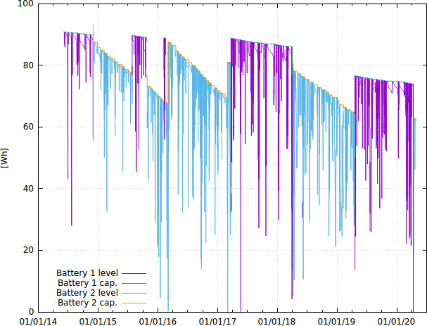

## Contents.
1. [What is this?](#what-is-this)
2. [Installation.](#installation)
3. [Notes.](#notes)

## What is this?
This github repository contains a simple shell script that can be used to log the capacity of your laptop battery. It relies on data that is made available by Linux under `/sys/class/power_supply/` and makes a timestamped copy of this data in a specified file every time the script is called (but only if the data has changed). Only data-logging, nothing else. But this gives quite interesting plots after a few years of running:

[](battery_large.png)

A few things to note:
* This plot contains data (capacity and level) for two batteries, alternating between the two.
* The capacity decreases when the battery is used and less so when it is not being used (unsurprisingly).
* The calibration (slope of the capacity curve as function of time) is very different for the two batteries.
* The capacity of battery 2 increases abruptly after it is drained completely. This seems to have an impact on the calibration.
* (Only visible in the higher-resolution version.) The capacity of battery 1 suddenly decreases when it is fully drained.

## Installation.
Without any warrenties.

### Step 1: Adjust path for log file.
First adjust the path to where the data should be written in the script `battery_log.sh`. It defaults to `/tmp/battery.log` and that file will be removed on every reboot, so your data will be lost. Therefore, look for the line
```
FILE_LOG=/tmp/battery.log # <- SPEFICY LOCATION FOR LOG FILE HERE
```
at the top of the script. Here you must give the absolute path to the output, i.e. replace `/tmp/battery.log` with a valid path to a (non-existing) file in your home directory.

### Step 2: Setup cron job.
You only need to install the script to be run as a cron job: 
Run `crontab -e` and add the following line (replace `[PATH]` with the path to the script):
```
*/2  * * * * [PATH]/battery_log.sh cron >/tmp/batterylog.log
```
That's it! I.e. it will log data every 2 minutes when running (at most). (The redirect `>/tmp/batterylog.log` for the cronjob above is only for debugging and can be left out.)


### Optional.
None of this is needed. Only if you want additional data points on start-up and shutdown, try the following.

#### Ubuntu 14.04
For Ubuntu 14.04 also install in rc etc.:
In `/etc/rc.local` add line 
`source [PATH]/battery_log.sh startup`
In `/etc/rc0.d/K10batterymon` add link to `../init.d/85batterymonshutdown`
In `/etc/rc6.d/K10batterymon` add link to `../init.d/85batterymonshutdown`
Create a file `/etc/init.d/85batterymonshutdown` with the following content (replace `[PATH]` with the path to the script):
```
#!/bin/bash
source [PATH]/battery_log.sh shutdown_initd
```
Create another file `/etc/pm/sleep.d/20_alex` with the following content (replace `[PATH]` with the path to the script):
```
#!/bin/bash
source [PATH]/battery_log.sh $1
```

#### Ubuntu 15.04+ (using systemd)
Create a file `/etc/systemd/system/batterylog.service` with the following content (replace `[PATH]` with the path to the script):
```
[Unit]
Description=Battery logging service

[Service]
Type=oneshot
RemainAfterExit=true
ExecStart=[PATH]/battery_log.sh startup_service
ExecStop=[PATH]/battery_log.sh shutdown_service

[Install]
WantedBy=multi-user.target
```
Run `systemctl enable batterylog`.
Create another file `/lib/systemd/system-sleep/battery_log` with the following content (replace `[PATH]` with the path to the script):
```
#!/bin/bash
source [PATH]/battery_log.sh $1 $2
```
and make this executable (`chmod +x ...`).

## Notes.
A line in ihe output log file might look like this:
```
1390222801 101 89480000 90720000 93240000 Discharging 0 10422000 12219000 45000 cron
```
The different columns mean the following:
* Unix timestamp
* serial number of the battery
* current charge (in µWh)
* charge when full (in µWh)
* design charge when full (in µWh, will be constant for all lines)
* status (Charging, Discharging, Full, Unknown)
* AC connected (0, 1)
* current power (in µW)
* current voltage (in V)
* current temperature
* source of this line (cron for cron job)

The temperature is read from `/sys/class/hwmon/hwmon0/temp1_input`. This may not be the right sensor for your machine. 

